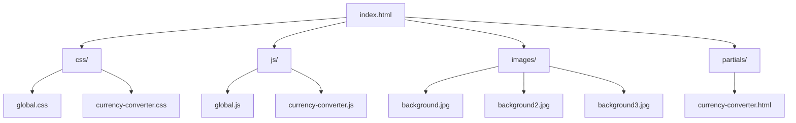

# 🚀项目描述

## 📁概述

## ✨功能

- 💱 汇率转换
- 📱 响应式设计

## 📜许可证

[MIT License](LICENSE)

## 📫联系方式

- 📧 邮箱: [changlai.bao@outlook.com](mailto:changlai.bao@outlook.com)
- 🐙 GitHub: [Changlai-Bao](https://github.com/Changlai-Bao)
- 🌐 个人网站: [https://Changlai-Bao.github.io](https://Changlai-Bao.github.io)
