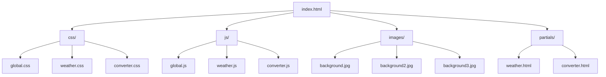

# Projektbeschreibung / Project Description / 项目描述

## Übersicht / Overview / 概述
  

```mermaid
graph TD
    A[index.html] --> B[css/]
    A --> C[js/]
    A --> D[images/]
    A --> E[partials/]
    B --> B1[global.css]
    B --> B2[weather.css]
    B --> B3[converter.css]
    C --> C1[global.js]
    C --> C2[weather.js]
    C --> C3[converter.js]
    D --> D1[background.jpg]
    D --> D2[background2.jpg]
    D --> D3[background3.jpg]
    E --> E1[weather.html]
    E --> E2[converter.html]
```

## Funktionen / Features / 功能
- 🌦️ Wetterinformationen anzeigen / Display weather information / 显示天气信息
- 💱 Währungsumrechnung / Currency conversion / 货币转换
- 📱 Responsives Design / Responsive design / 响应式设计

## Technologien / Technologies / 技术
| Sprache/Framework | Version | Verwendung | Dokumentation |
|-------------------|---------|------------|---------------|
| HTML              | 5       | Struktur   | [MDN](https://developer.mozilla.org/de/docs/Web/HTML) |
| CSS               | 3       | Styling    | [MDN](https://developer.mozilla.org/de/docs/Web/CSS) |
| JavaScript        | ES6     | Logik      | [MDN](https://developer.mozilla.org/de/docs/Web/JavaScript) |
| Bootstrap         | 5.3     | Layout     | [Bootstrap](https://getbootstrap.com/docs/5.3/getting-started/introduction/) |

## Installation / Installation / 安装
1. Repository klonen:
```bash
git clone https://github.com/Tobias-Bao/Tobias-Bao.github.io.git
```
2. Projekt öffnen:
```bash
cd Tobias-Bao.github.io
```
3. Im Browser öffnen:
```bash
start index.html
```

## Beitrag / Contribution / 贡献
```diff
+ Wir freuen uns über Beiträge! / We welcome contributions! / 欢迎贡献！
```
1. Fork das Repository
2. Erstelle einen neuen Branch (`git checkout -b feature/AmazingFeature`)
3. Committe deine Änderungen (`git commit -m 'Add some AmazingFeature'`)
4. Push zum Branch (`git push origin feature/AmazingFeature`)
5. Öffne einen Pull Request

## Lizenz / License / 许可证
[MIT](https://choosealicense.com/licenses/mit/)

## Kontakt / Contact / 联系方式
- 📧 Email: changlai.bao@outlook.com.com
- 🐙 GitHub: [Tobias-Bao](https://github.com/Changlai-Bao)
- 🌐 Website: [https://tobias-bao.github.io](https://tobias-bao.github.io)

---

🔗 **Nützliche Links / Useful Links / 有用链接**  
[Projekt Wiki](https://github.com/Tobias-Bao/Tobias-Bao.github.io/wiki) | 
[Issue Tracker](https://github.com/Tobias-Bao/Tobias-Bao.github.io/issues) | 
[Changelog](https://github.com/Tobias-Bao/Tobias-Bao.github.io/releases)
