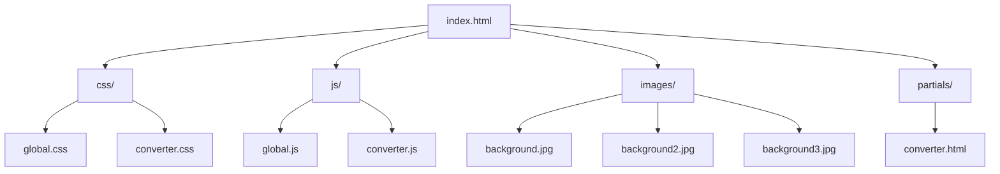

# 🚀项目描述

## 📁概述

```mermaid
graph TD
    A[index.html] --> B[css/]
    A --> C[js/]
    A --> D[images/]
    A --> E[partials/]
    B --> B1[global.css]
    B --> B2[converter.css]
    C --> C1[global.js]
    C --> C2[converter.js]
    D --> D1[background.jpg]
    D --> D2[background2.jpg]
    D --> D3[background3.jpg]
    E --> E1[converter.html]
```

## ✨功能
- 💱 货币转换
- 📱 响应式设计

## 📜许可证
[MIT License](LICENSE)

## 📫联系方式
- 📧 邮箱: changlai.bao@outlook.com
- 🐙 GitHub: [Changlai-Bao](https://github.com/Changlai-Bao)
- 🌐 个人网站: [https://Changlai-Bao.github.io](https://Changlai-Bao.github.io)
