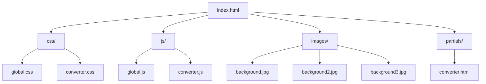

# 🚀Projektbeschreibung / Project Description / 项目描述

## 📁Übersicht / Overview / 概述
![Projektstruktur]  

```mermaid
graph TD
    A[index.html] --> B[css/]
    A --> C[js/]
    A --> D[images/]
    A --> E[partials/]
    B --> B1[global.css]
    B --> B2[converter.css]
    C --> C1[global.js]
    C --> C2[converter.js]
    D --> D1[background.jpg]
    D --> D2[background2.jpg]
    D --> D3[background3.jpg]
    E --> E1[converter.html]
```

## ✨Funktionen / Features / 功能
- 💱 Währungsumrechnung / Currency conversion / 货币转换
- 📱 Responsives Design / Responsive design / 响应式设计

## 🛠️Installation / Installation / 安装
1. Repository klonen:
```bash
git clone https://github.com/Tobias-Bao/Tobias-Bao.github.io
```
2. Projekt öffnen:
```bash
cd Tobias-Bao.github.io
```
3. Im Browser öffnen:
```bash
start index.html
```

## 📜Lizenz / License / 许可证
[MIT License](LICENSE)

## 📫Kontakt / Contact / 联系方式
- 📧 Email: changlai.bao@outlook.com
- 🐙 GitHub: [Changlai-Bao](https://github.com/Changlai-Bao)
- 🌐 Website: [https://Changlai-Bao.github.io](https://Changlai-Bao.github.io)

---
